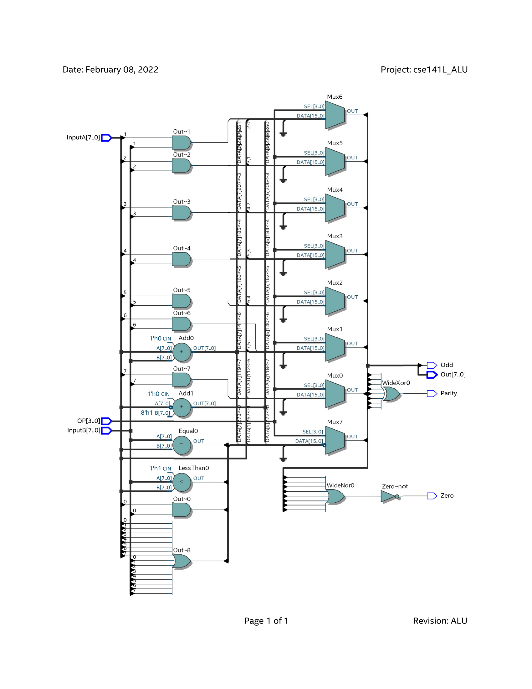
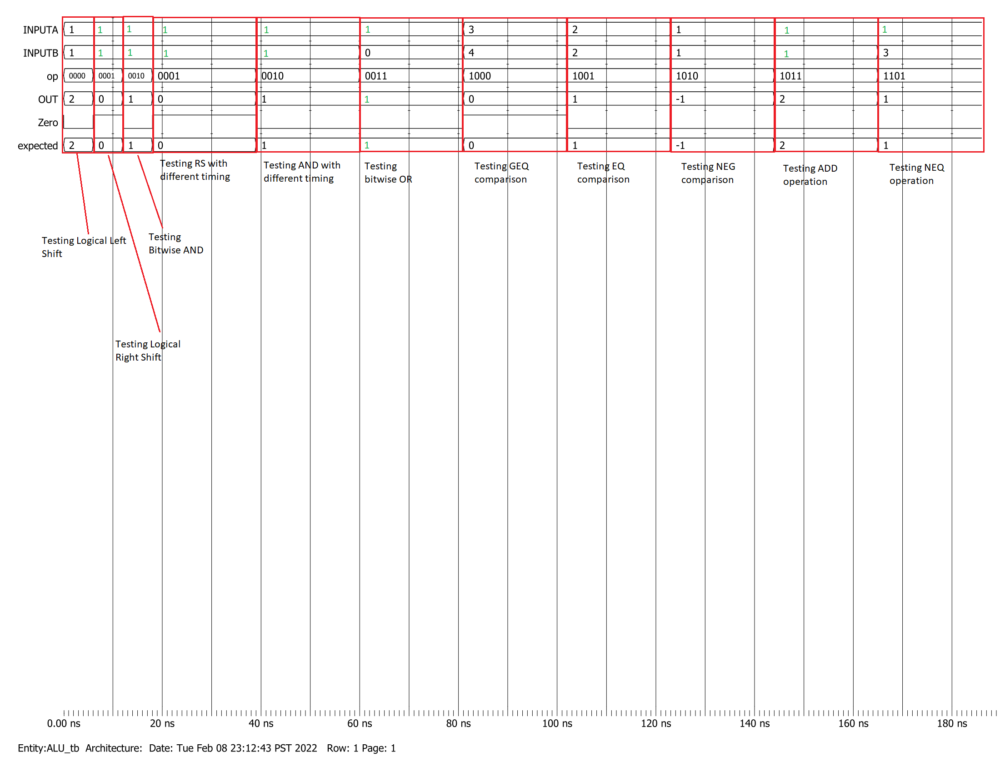

# **MILESTONE 2 DOCUMENT**
### Date Created: 2/4/2022
### Date Last Updated: 2/9/2022
### Group Members: Daisuke Chon, Angelica Consengco, Matthew Larkins
### PIDs: A15388691, A14113566, A16052530
* * *
## **Component 1:** Changelog
1. Specified that addresses are absolute rather than relative under Component 3, Part iv. of Milestone 1: Machine Specification - Control Flow
2. Added assembly language instruction to machine code translation example under Component 4 of Milestone 1: Programmer's Model
* * *
## **Component 2:** ALU operations

Our ALU should be able to support the following operations:
  - logical left shift
  - logical right shift
  - bitwise and
  - bitwise or
  - Greater than or equal comparison
  - Equals comparison
  - 2's Comp Negation
  - Addition
  - Not Equals comparison

Our register file does (idk what the fuck to put here)

* * *
## **Component 3:** Verilog Models

* * * 
## **Component 4:** Timing Diagrams
[comment]: #Provide well-annotated timing diagrams or transcript listings from your module level Questa/ModelSim runs. It should be clear that your program counter / instruction memory (fetch unit) and ALU works. If your presentation leaves doubt, we’ll assume it doesn’t.
### ALU Timing Diagram 

* * *
## **Component 5:** Answering the Question
 Our ALU will *indirectly* be used for non-arithmetic instructions such as load and store. While we do indeed need to make address pointer calculations, the programmer will be responsible for calculating these addresses via manual shift operations of 3 bit immediates into 8 bit values. As such, the complexity of the design is unaffected.