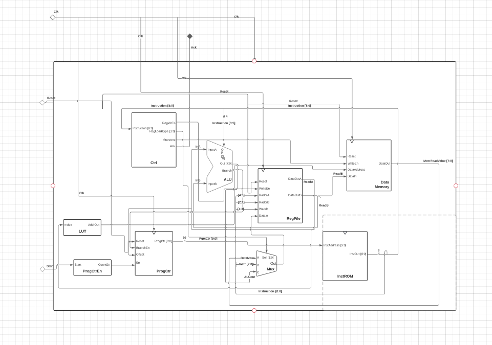

# **MILESTONE 3 DOCUMENT**
### Date Created: 2/22/2022
### Date Last Updated: 2/23/2022
### Group Members: Daisuke Chon, Angelica Consengco, Matthew Larkins
### PIDs: A15388691, A14113566, A16052530
* * *
## **Component 1:** Changelog
1. Changed how jumps are done using the program counter. Information is updated on Milestone 1.
2. Changed design of how data addressing works. Information is updated on Milestone 1.

## **Component 2:** Assembler Input and Output Example
We wrote the assembler in Python and the code is shown below. For debugging purposes, the rest of the instruction memory is filled with "xxxxxxxxx" as implemented in the original sample code and the "unused bits" in the R-Type instruction are replaced with a '0' padding. To test the assembler, we created an input file 'test_assembly.asm' that used all 14 of our ISA's instructions and mixed in all of possible registers that could be used. We also included comments and blank lines to test if the assembler would handle these cases. We created a file with the expected output of the assembler by typing out the encoding for each instruction so that we could compare this against the actual output. The output produced by the assembler was correct. The input, output, and test files mentioned are all shown below.
### Code:
	import re
	#!/usr/bin/env python3

	# Totally optional, here's a neat thing:
	# You can create a reverse-mapping, such that waveform tools will show the
	# original instruction.
	# The waveform viewing tool needs a mapping of # `$value $display_string`.
	# Only want to write each unique machine code once though.
	mcodes = set()

	# Here's a lookup table for opcodes
	ops = {
					'ls': '0000',
					'rs': '0001',
					'and': '0010',
					'or' : '0011',
					'ldi' : '0100',
					'ldr' : '0101',
					'str' : '0110',
					'bnz' : '0111',
					'geq' : '1000',
					'eq' : '1001',
					'neg' : '1010',
					'add' : '1011',
					'addi' : '1100',
					'neq' : '1101'
					}

	# This is a neat trick to catch programming errors
	TOTAL_IMEM_SIZE = 2**10

	# Don't need to do anything fancy here
	with open('test_assembly.asm') as ifile, open('machine_out.hex', 'w') as imem, open('gtkwave/mcode.fmt', 'w') as wavefmt:
			for lineno, line in enumerate(ifile):
					try:
							# Skip over blank lines, remove comments
							line = line.strip()
							line = line.split('//')[0].strip()
							if line == '':
									continue
			
							# Special-case this:
							if line[:4] == 'halt':
									machine_code = '111111111'
							# I-Type: Op rs, imm
							# R-Type: Op rd, rs (plus one zero for padding unused bit)
							insn = re.split(' |, ', line)
							op = insn[0]
							#if instruction is I-Type: Op rs, imm
							if insn[2].startswith('#'):
									imm = '{:03b}'.format(int(insn[2].split('#')[1]))
									rs = '{:02b}'.format(int(insn[1].split('r')[1]))
									machine_code = ops[op] + rs + imm
							#if instruction is nop
							elif (op == 'nop'):
									machine_code = '111100000'
							#if instruction is R-type: Op rd, rs (plus one zero for padding unused bit)
							else:
									rd = '{:02b}'.format(int(insn[1].split('r')[1]))
									rs = '{:02b}'.format(int(insn[2].split('r')[1]))
									machine_code = ops[op] + rd + rs + '0'
							# Write the imem entry
							imem.write(machine_code + '\n')
							TOTAL_IMEM_SIZE -= 1

							# Write out our waveform decoder
							if machine_code not in mcodes:
									line = line.replace('\t', ' ')
									wavefmt.write('{} {}\n'.format(machine_code, line))
									mcodes.add(machine_code)
					except:
							print("Error Parsing Line ", lineno)
							print(">>>{}<<<".format(line))
							print()
							raise

			# This is a neat trick to catch programming errors:
			# Fill the rest of instruction memory with illegal instructions.
			#
			wavefmt.write('xxxxxxxxx ILLEGAL!')
			while TOTAL_IMEM_SIZE:
					imem.write('xxxxxxxxx\n')
					TOTAL_IMEM_SIZE -= 1

### Input file (test_assembly.asm): 
	//left shift: r0 = r0 << 2
	ls r0, #2 

	//right shift: r0 = r0 << 3
	rs r0, #3

	//bitwise AND: r0 = r0 & r1
	and r0, r1 

	//bitwise OR: r0 = r0 || r1
	or r0, r1

	//load immediate: r0 = 7
	ldi r0, #7

	//load register: r2 = MEM[r0]
	ldr r2, r0

	//store register: MEM[r0] = r2
	str r2, r0

	//equals: r1 = (r1 == r2)
	eq r1, r2 

	//branch if not equal to zero: if r1 == 1, go to address in R3
	bnz r3, r1

	//greater than or equal to: r0 = (r0 >= r1)
	geq r0, r1

	//2's complement: r1 = (~r1 + 1)
	neg r1, r1 

	//add: r0 = r0 + r1
	add r0, r1

	//add immediate: r0 = r0 + 3
	addi r0, #3

	//not equal to: r0 = (r0 != r1)
	neq r0, r1

### Expected output file (expected_machine_code.txt):
	000000010 //ls r0, #2 
	000100011 //rs r0, #3
	001000010 //and r0, r1 
	001100010 //or r0, r1
	010000111 //ldi r0, #7
	010110000 // ldr r2, r0
	011010000 //str r2, r0
	100101100 //eq R1, R2 
	011111010 //bnz R3, R1
	100000010 //geq r0, r1 
	101001010 //neg r1, r1 
	101100010 //add r0, r1
	110000011 //addi r0, #3
	110100010 //neq r0, r1

### Actual output file (machine_out.hex), with the 'xxxxxxxxx' lines truncated for space:
	000000010
	000100011
	001000010
	001100010
	010000111
	010110000
	011010000
	100101100
	011111010
	100000010
	101001010
	101100010
	110000011
	110100010
* * *
## **Component 3:** Architectural Overview figure

* * * 
